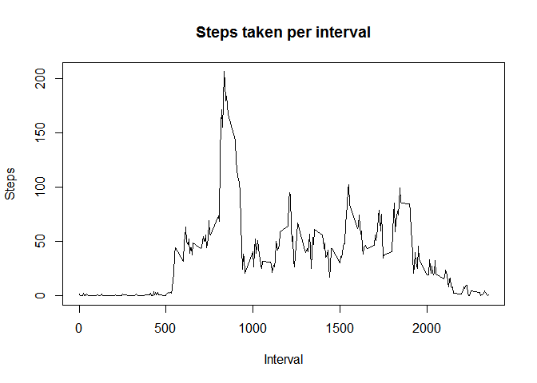
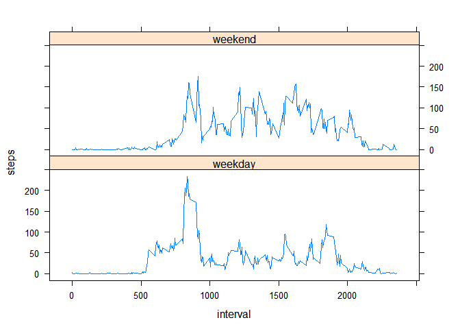

# Reproducible Research: Peer Assessment 1


## Loading and preprocessing the data

```r
  ## Unzip the archive if necessary
  if(! file.exists("activity.csv")) {
    unzip("activity.zip")
  }

  ## Read the csv data
  raw_data <- read.csv("activity.csv")

  ## Aggregate the raw data as sum of steps per day
  steps_per_day <- aggregate(steps ~ date, data = raw_data, FUN=sum)

  ## Aggregate the raw data as sum of steps per interval
  steps_per_interval <- aggregate(steps ~ interval, data = raw_data, FUN=sum)
```


## What is mean total number of steps taken per day?


```r
  ## Draw a histogram of the steps recorded per day
  hist(steps_per_day$steps, main = "Steps taken per day", xlab = "Steps", col="blue")
```

 


```r
  ## Calculate the mean and median values of the steps recorded per day
  mean_steps_per_day <- mean(steps_per_day$steps, na.rm = FALSE)
  median_steps_per_day <- median(steps_per_day$steps, na.rm = FALSE)
```

The mean of the recorded step data per day is 10766.19 (rounded to two decimal places). The median of the recorded step data per day is 10765.


## What is the average daily activity pattern?


```r
  ## Draw a line graph of the steps recorded per interval
  with(steps_per_interval, plot(interval, steps, type = "n", main = "Steps taken per interval", xlab = "Interval", ylab = "Steps"))
  with(steps_per_interval, lines(interval, steps, type="l"))
```

 


```r
  ## Subset the interval with most steps
  max_steps <- max(steps_per_interval$steps)
  max_interval <- subset(steps_per_interval, steps == max_steps)$interval
```

The interval with most steps is interval 835 with 10927 recorded steps.


## Imputing missing values


```r
  ## Count the number of NA data points
  number_na <- sum(is.na(raw_data$steps))
```

There are 2304 invalid data points in the data set. To compensate for those unrecorded data points, we're calculating a derived data set, where invalid values are replaced by the mean for the respective interval.


```r
  ## Aggregate a data set of mean steps per interval
  mean_steps_per_interval <- aggregate(steps ~ interval, data = raw_data, FUN=mean)

  ## Copy the data set
  imputed_data <- raw_data

  ## For each interval, replace the NA values with the mean for the interval
  for(interval in mean_steps_per_interval$interval) {

    ## Subset and round the mean for the interval
    interval_mean <- mean_steps_per_interval[mean_steps_per_interval$interval == interval, 2]
    rounded_mean <- round(interval_mean)

    ## Replace all NA values
    imputed_data[is.na(imputed_data$steps) & imputed_data$interval == interval, 1] <- rounded_mean
  }

  ## Aggregate the imputed data as sum of steps per day
  imputed_steps_per_day <- aggregate(steps ~ date, data = imputed_data, FUN=sum)

  ## Draw a histogram of the steps recorded per day
  hist(imputed_steps_per_day$steps, main = "Steps taken per day (with imputed data)", xlab = "Steps", col="blue")
```

 


```r
  ## Calculate the mean and median values of the steps recorded per day
  imputed_mean_steps_per_day <- mean(imputed_steps_per_day$steps, na.rm = FALSE)
  imputed_median_steps_per_day <- median(imputed_steps_per_day$steps, na.rm = FALSE)
```

The mean of the recorded step data per day is 10765.64 (rounded to two decimal places). The median of the recorded step data per day is 10762 (rounded).

Since invalid data has the same impact to a sum as a zero-value, the histogram with imputed points shows higher frequencies (representing higher daily step sums) than the histogram based on the data set with invalid data points in it. The median and mean however are almost unchanged, since the invalid values don't influenced their calculation in neither data set.


## Are there differences in activity patterns between weekdays and weekends?

The weekdays have a significant spike in the morning and a few more less prominent spikes in typical break or knocking-off times. The weekend seems quite balanced during the day in comparison, especially in the morning.


```r
  ## Add a weekend indicator variable to the raw data set
  wday_classifier <- c("weekend", "weekday", "weekday", "weekday", "weekday", "weekday", "weekend")
  raw_data$weekend_indicator <- wday_classifier[as.POSIXlt(raw_data$date)$wday + 1]

  ## Aggregate the raw data as sum of steps per interval
  steps_per_interval_compared <- aggregate(steps ~ interval + weekend_indicator, data = raw_data, FUN=sum)
```


```r
  ## We use the lattice system for this graph
  library(lattice)

  ## Draw line graphs of the steps recorded per interval, grouped by weekend indicator
  xyplot(steps ~ interval | weekend_indicator, data = steps_per_interval_compared, type = "l",
        layout = c(1, 2))
```

 
